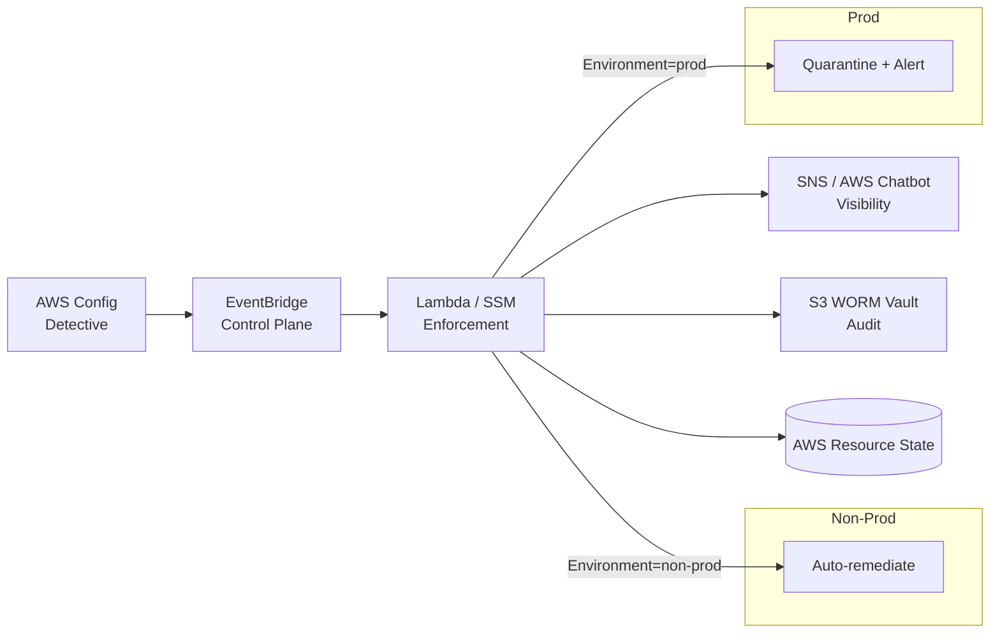

# AWS Event-Driven Compliance Engine

## Problem statement
Modern cloud environments drift quickly. Security controls that are manually enforced or reviewed late become silent risk exposure points. This project addresses the need for an event-driven compliance control plane that detects non-compliant AWS resources, evaluates the violation in context, and responds with environment-aware remediation.

The engine is designed to automatically detect and act on common misconfigurations such as:

- Public S3 bucket exposure
- Unapproved IAM administrative policies
- Overly permissive Security Group ingress rules
- Config drift that violates governance guardrails

The core problem is not just detection; it is the translation of a compliance signal into a controlled, auditable enforcement action that respects environment risk. In non-production, the system can auto-remediate. In production, it should quarantine the resource, alert stakeholders, and preserve evidence in an immutable audit vault.

## Architecture overview



## Ordered service flow
1. AWS Config (Detective)
2. EventBridge (Control Plane)
3. Lambda / SSM (Enforcement)
4. SNS / Chatbot (Visibility)
5. S3 WORM Vault (Audit)

This sequence ensures that detection happens first, event routing is centralized, enforcement is controlled and policy-driven, notifications are visible to operators, and all actions are preserved in an immutable audit trail.

## Environment-aware remediation logic

The enforcement path is driven by the target environment.

| Environment | Default action | Description |
| --- | --- | --- |
| Non-Prod | Auto-remediate | The system attempts to correct the issue immediately and records the action to reduce developer friction while keeping guardrails active. |
| Prod | Quarantine + alert | The system isolates or blocks the offending resource, triggers operational alerts, and requires human review before full recovery. |

### Example decision model

```text
if resource.environment == "non-prod":
    if violation is allowed by policy:
        remediate automatically
    else:
        notify owners and log decision
else if resource.environment == "prod":
    quarantine resource
    revoke public access or detach policy
    publish SNS notification
    create change ticket or escalation event
    write immutable audit record to S3 WORM Vault
```

### Remediation examples
- Public S3 bucket policy: remove public access or rewrite bucket policy to a restricted baseline.
- Unapproved IAM admin policy: detach the policy and notify the resource owner.
- Security Group open ingress: revoke overly permissive 0.0.0.0/0 or ::/0 rules.

## Design principles
- Detection first, remediation second.
- Environment-aware enforcement to avoid risky automation in production.
- Centralized event control using EventBridge.
- Immutable audit storage for evidence and compliance review.
- Infrastructure as Code so controls are versioned and repeatable.

## Repository structure

```text
aws-event-driven-compliance-engine/
├── main.tf
├── variables.tf
├── outputs.tf
├── requirements.txt
├── README.md
├── RUNBOOK.md
├── .gitignore
├── modules/
│   ├── compliance_rules/
│   │   └── README.md
│   ├── remediation_engine/
│   │   └── README.md
│   └── audit_logging/
│       └── README.md
├── python/
│   ├── common.py
│   ├── s3_public_access_remediator.py
│   ├── iam_policy_guardrail_remediator.py
│   ├── security_group_ingress_remediator.py
│   └── README.md
├── examples/
│   ├── test_resources.tf
│   └── README.md
├── infra/
│   └── terraform/
│       └── README.md
├── src/
│   └── lambda/
│       └── README.md
├── tests/
│   └── README.md
└── Prompts.md
```

## Target deployment model
This project is designed for an AWS-native architecture that can be deployed in a multi-account or single-account organization model. The core controls are:

- AWS Config rules for continuous detective monitoring
- EventBridge rules for event routing and filtering
- Lambda for custom enforcement logic
- Systems Manager Automation for complex or multi-step workflows
- SNS and AWS Chatbot for operational visibility
- S3 Object Lock or WORM-compatible storage for evidence retention

## Getting started
Prerequisites are Terraform `>= 1.5.0`, the AWS CLI configured for a deployable account, and Python 3.12 or newer for local tests. Follow [RUNBOOK.md](RUNBOOK.md) for the complete setup and deployment procedure.

For local development and tests, create a virtual environment and install the root [requirements.txt](requirements.txt). The [python/requirements.txt](python/requirements.txt) file is the separate Lambda runtime dependency set and should not include development tools such as Moto or pytest.

The root stack creates two S3 buckets: an `aws-config-delivery-*` bucket for AWS Config service data and a Compliance-mode `compliance-evidence-vault-*` bucket for audit evidence. Their exact random-suffixed names are available with `terraform output -raw config_delivery_bucket_name` and `terraform output -raw audit_bucket_name`. Do not use either bucket as the intentionally non-compliant test fixture.

## Cost and billing warning

> **Important: this project creates billable AWS resources.** Do not deploy it in a production or long-lived account without a budget, billing alerts, and an owner responsible for cleanup. Costs vary by region, event volume, configuration items, rule evaluations, storage, requests, log retention, and data transfer. This README does not provide a guaranteed monthly price.

The main cost drivers are:

- **AWS Config:** configuration items, recorder activity, and evaluations for the three managed rules.
- **S3:** the Config delivery bucket and audit evidence bucket incur storage and request charges. The audit bucket uses Compliance-mode Object Lock, so retained objects cannot be deleted before their retention period expires.
- **AWS KMS:** the customer-managed audit key has a monthly key charge plus API request charges.
- **Lambda, EventBridge, SNS, SSM Automation, and CloudWatch Logs:** normally small for a low-volume test, but costs increase with event frequency, remediation retries, notifications, automation executions, and log volume.
- **Optional fixture resources:** the `examples/` stack creates intentionally non-compliant S3, IAM, and Security Group resources. It does not create EC2 instances, but its S3 bucket still incurs storage and request charges.

Before applying, confirm the target account and region, set an AWS Budget or billing alarm, and review the Terraform plan. After testing, destroy the fixture first and then the root stack. Check S3 Object Lock retention before cleanup because Compliance-mode objects may remain billable until retention expires.

Review current charges in the AWS Billing console or Cost Explorer. Billing data can be delayed, so verify costs again after resources are removed.

## Security posture
The project intentionally separates detection and enforcement from operational visibility and audit storage. This allows the architecture to remain resilient, explainable, and evidence-driven. All actions should be logged with resource metadata, actor context, evaluation result, and final state.

